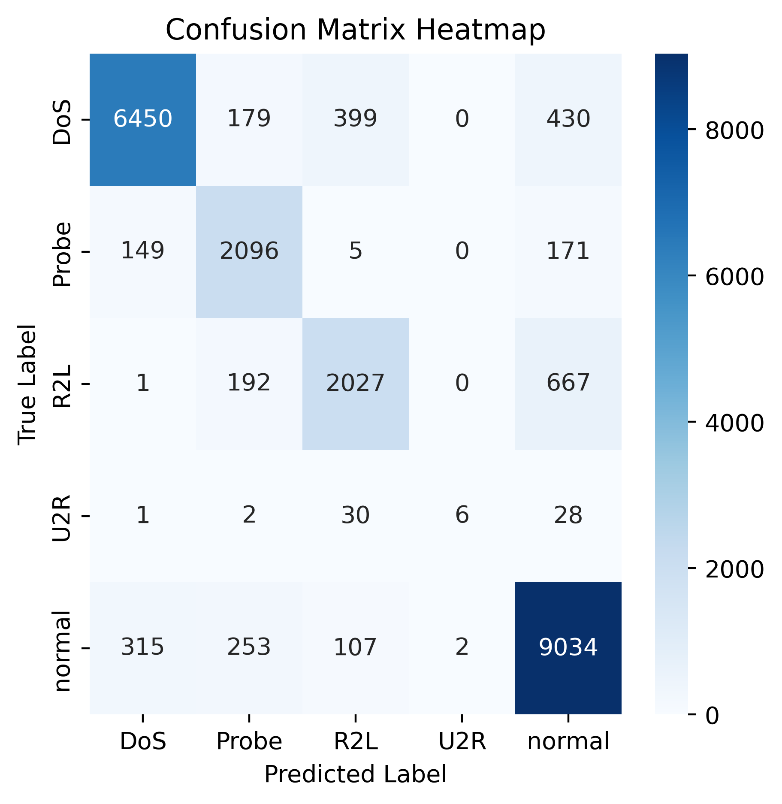
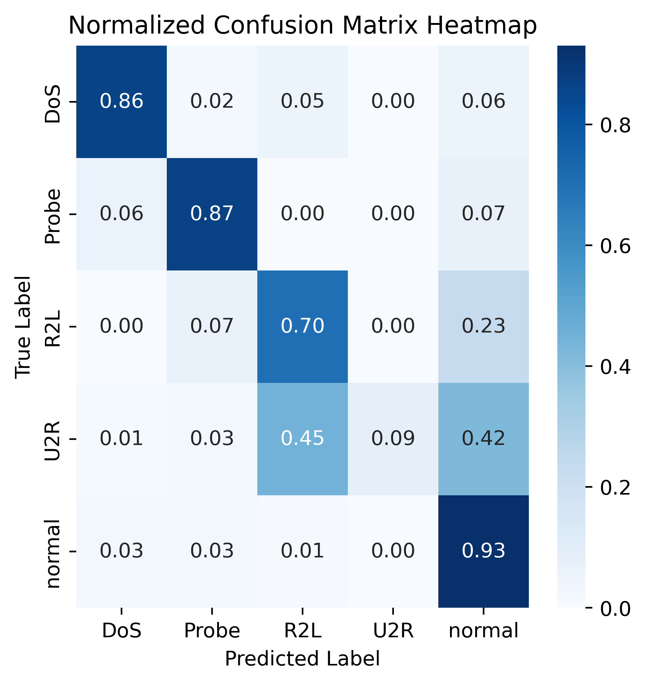
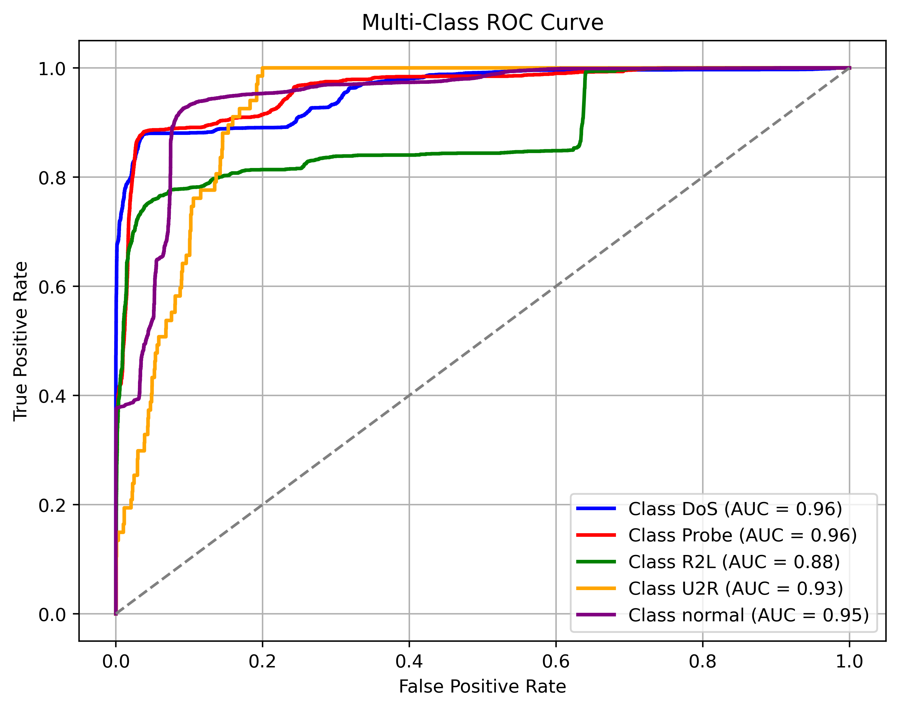
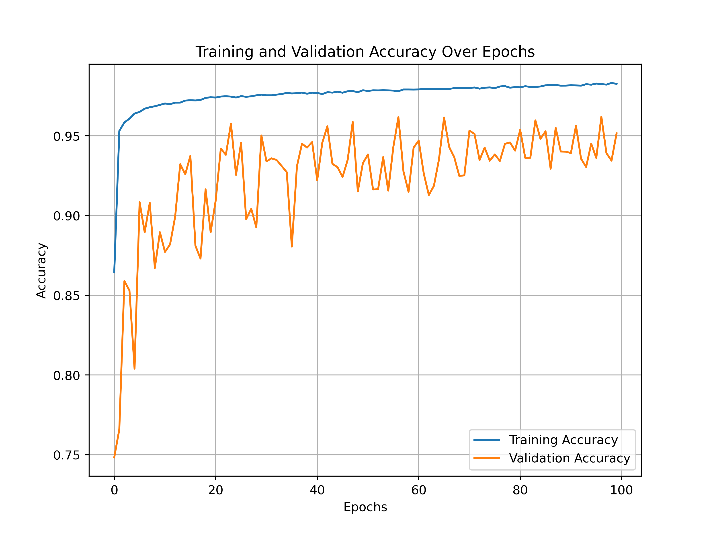

# Network Intrusion Detection with CNN and CTGAN-Synthetic Data

**Author:** Leo Martinez III - [LinkedIn](https://www.linkedin.com/in/leo-martinez-iii/)

**Contact:** [leo.martinez@students.tamuk.edu](mailto:leo.martinez@students.tamuk.edu)

**Created:** Fall 2024 - Spring 2025

---

# 5-Class Network Intrusion Detection System using Deep Learning

This project utilizes a Convolutional Neural Network (CNN) trained on a blend of real and synthetic data (generated using CTGAN) to classify network traffic into five categories. Tabular data was converted into image data to ensure it was suitable for the CNN. The system is designed for robust evaluation and visualization and addresses class imbalance using undersampling and generating synthetic samples.

## The models and results are organized by folder

The necessary data, results, information are stored in their respective folders as described at the bottom of this document.
Key outputs like accuracy plots, confusion matrices, and AUC curves are stored in the results folder.

### Main Dependencies

- TensorFlow
- Keras
- Scikit-learn
- Matplotlib
- Seaborn
- imbalanced-learn
- NumPy
- Pandas

## License

This project is licensed under the [MIT License](LICENSE).

## Note:

- Program was created using Spyder v6.0.3 with Python v3.9.21 for training and testing.
- A separate virtual environment was used for the CTGAN section due to conflicting dependencies.
- Training was conducted on a high end local machine using a 16 core (32 thread) processor.
- Due to the large size, the synthetic data was not included in the data folder and is available upon request.
- Simarily, not all images used for training and testing were included in the images folder due to the large amount (only images 0-20 for each folder) and is available upon request.

Here is a brief explanation of the items:
- **src:** Contains the main Python (.py) script for model training and evaluation (separated by sections)
- **data:** Contains real + CTGAN-synthetic data used in training
- **figures:** Contains images regarding the model and context around the methodology
- **images:** Contains the tabular data that was transformed into image data for the CNN
- **model:** Contains the pretrained saved model (.h5) that can be reused at anytime for testing purposes
- **results:** Contains accuracy plots, confusion matrices, AUC visualizations, and model performance information
- **dependencies_utilized.txt:** Describes the specific libraries with versions used in both virtual environments for the .py script
- **README.md:** Describes the purpose, structure, and requirements of the project
- **LICENSE:** Includes license details for the repository
